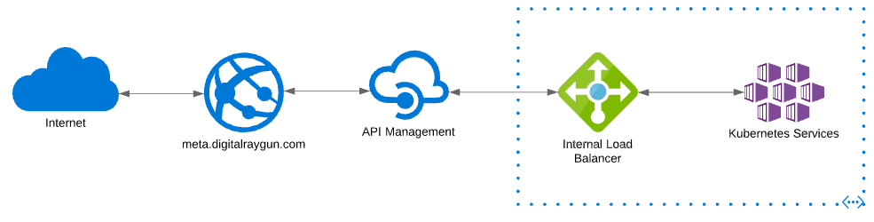
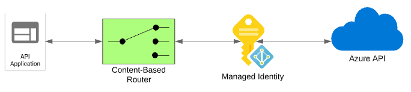

# api

## Description

### External High-Level Architecture



### Internal High-Level Architecture



ExpressJS
AAD Pod Identity

## Manual Snippets

These snippets are used for manual steps for API development. Goal is to get this automated via Terraform/Pipelines/etc.

```
az aks show -g service-cus-dev -n aks01-cus-dev --query identityProfile.kubeletidentity.clientId -otsv
```

```
docker image tag src:latest digitalraygun.azurecr.io/api:latest
docker push digitalraygun.azurecr.io/api:latest
```

```
helm upgrade -i csi csi-secrets-store-provider-azure/csi-secrets-store-provider-azure -f .\configs\secretsStoreCsiDriver\values.yaml
```

```
helm install aad-pod-identity aad-pod-identity/aad-pod-identity -f ./configs/aadPodIdentity/values.yaml
```

```
helm upgrade -i api charts/api --namespace api --create-namespace -f ./configs/api/values.yaml
```

```
kubectl create secret generic azure-dns-secret --from-literal=subscription-id=* --from-literal=dns-zone=* --from-literal=resource_group=* --namespace api
```

```
az role definition create --role-definition .\configs\azureRbac\dns-zone-reader.json
az role definition update --role-definition .\configs\azureRbac\dns-zone-reader.json
```